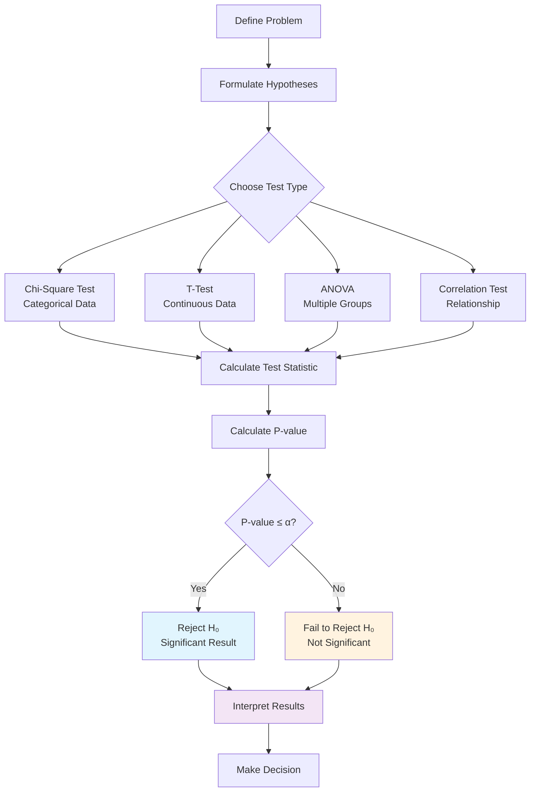
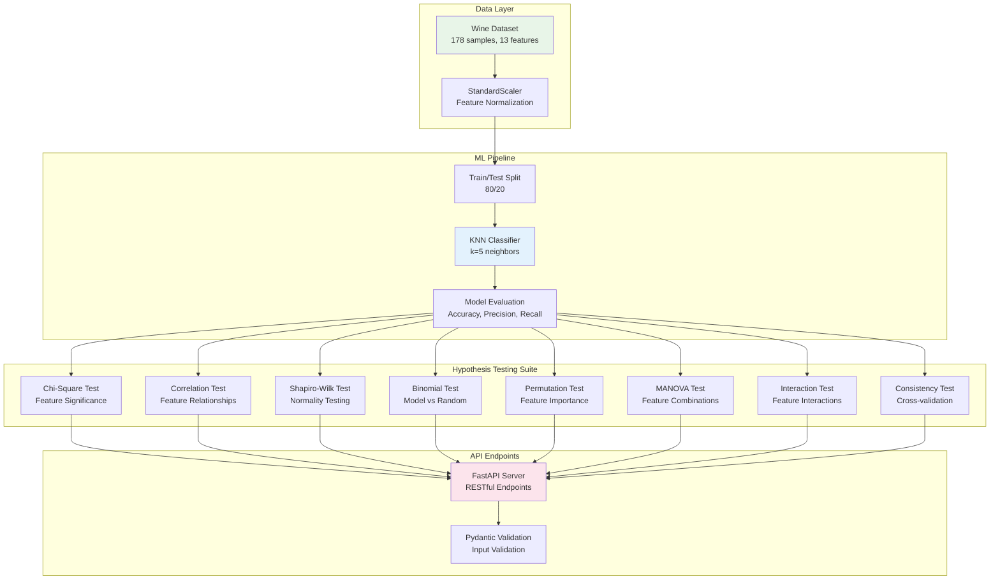
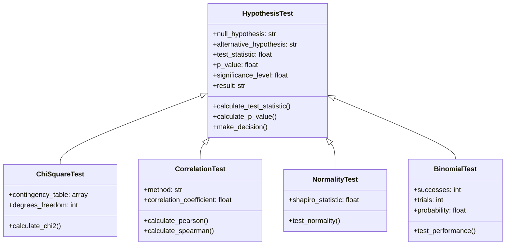

# Hypothesis Testing in Machine Learning - Complete Guide

## Overview

Hypothesis testing is a fundamental statistical method used to make decisions about population parameters based on sample data. In machine learning, it helps validate model performance, feature significance, and statistical assumptions underlying our algorithms.

## Core Concepts

### What is Hypothesis Testing?

Hypothesis testing is a systematic procedure that uses sample data to evaluate hypotheses about population parameters. It involves:

1. **Null Hypothesis (H₀)**: The default assumption (no effect/difference)
2. **Alternative Hypothesis (H₁)**: The claim we want to test
3. **Test Statistic**: A value calculated from sample data
4. **P-value**: Probability of observing the test statistic under H₀
5. **Significance Level (α)**: Threshold for rejecting H₀ (commonly 0.05)

### Decision Rules

- **Reject H₀**: If p-value ≤ α (statistically significant)
- **Fail to Reject H₀**: If p-value > α (not statistically significant)

## Hypothesis Testing Workflow



## Wine KNN Project Architecture



## Hypothesis Tests in Wine KNN Project

### 1. Feature Significance Test (Chi-Square)
```python
# Example: Test if alcohol content affects wine classification
{
  "feature": "alcohol",
  "bins": 5
}
```
- **H₀**: Alcohol content is independent of wine class
- **H₁**: Alcohol content is associated with wine class
- **Use Case**: Identify discriminative features

### 2. Feature Correlation Test
```python
# Example: Test correlation between alcohol and color intensity
{
  "f1": "alcohol",
  "f2": "color_intensity", 
  "method": "pearson"
}
```
- **H₀**: No correlation exists between features
- **H₁**: Significant correlation exists
- **Use Case**: Feature redundancy detection

### 3. Normality Test (Shapiro-Wilk)
```python
# Example: Test if residual sugar follows normal distribution
{
  "feature": "residual_sugar"
}
```
- **H₀**: Feature follows normal distribution
- **H₁**: Feature does not follow normal distribution
- **Use Case**: Validate parametric test assumptions

### 4. Model vs Random Performance
```python
# No input required - uses trained model
{}
```
- **H₀**: Model performs no better than random guessing
- **H₁**: Model performs significantly better than chance
- **Use Case**: Validate model effectiveness

### 5. Feature Importance Test
```python
# Permutation-based importance testing
{}
```
- **H₀**: Feature has no predictive importance
- **H₁**: Feature contributes significantly to predictions
- **Use Case**: Feature selection and model interpretation

### 6. Feature Combination Test (MANOVA)
```python
# Example: Test multiple features jointly
{
  "features": ["alcohol", "color_intensity", "pH"]
}
```
- **H₀**: Features jointly do not discriminate between classes
- **H₁**: Features jointly discriminate between classes
- **Use Case**: Multivariate feature analysis

### 7. Feature Interaction Test
```python
# Example: Test interaction between alcohol and color intensity
{
  "f1": "alcohol",
  "f2": "color_intensity"
}
```
- **H₀**: No interaction effect between features
- **H₁**: Significant interaction effect exists
- **Use Case**: Identify feature synergies

### 8. Model Consistency Test
```python
# Example: Test performance consistency across folds
{
  "n_splits": 5
}
```
- **H₀**: Model performance is consistent across different data splits
- **H₁**: Model performance varies significantly
- **Use Case**: Assess model stability

## Statistical Testing Framework



## Libraries for Hypothesis Testing

### Core Statistical Libraries

1. **SciPy (scipy.stats)**
   - `chi2_contingency()`: Chi-square test for independence
   - `pearsonr()`, `spearmanr()`: Correlation tests
   - `shapiro()`: Normality testing
   - `binom_test()`: Binomial testing
   - `f_oneway()`: One-way ANOVA

2. **StatsModels**
   - `MANOVA`: Multivariate analysis of variance
   - `ols()`: Ordinary least squares regression
   - Advanced statistical modeling

3. **Scikit-learn**
   - `permutation_importance()`: Feature importance testing
   - `cross_val_score()`: Cross-validation metrics
   - `train_test_split()`: Data splitting

### Specialized Libraries

4. **Pingouin**
   - User-friendly statistical functions
   - Effect size calculations
   - Multiple comparison corrections

5. **PyMC3/PyMC4**
   - Bayesian hypothesis testing
   - Probabilistic programming

6. **Seaborn/Matplotlib**
   - Statistical data visualization
   - Hypothesis test result plotting

## Predefined Functions for Hypothesis Testing

### SciPy Statistical Tests
```python
from scipy.stats import (
    chi2_contingency,    # Chi-square independence test
    pearsonr, spearmanr, # Correlation tests
    shapiro,            # Normality test
    binom_test,         # Binomial test
    ttest_ind,          # Independent t-test
    ttest_rel,          # Paired t-test
    mannwhitneyu,       # Mann-Whitney U test
    wilcoxon,           # Wilcoxon signed-rank test
    kruskal,            # Kruskal-Wallis H test
    f_oneway,           # One-way ANOVA
    levene,             # Levene's test for equal variances
    bartlett,           # Bartlett's test for equal variances
    anderson,           # Anderson-Darling normality test
    kstest,             # Kolmogorov-Smirnov test
    fisher_exact        # Fisher's exact test
)
```

### StatsModels Functions
```python
from statsmodels.stats import (
    contingency_tables,  # Contingency table tests
    multitest,          # Multiple testing corrections
    power,              # Statistical power analysis
    weightstats         # Weighted statistics
)
from statsmodels.multivariate.manova import MANOVA
from statsmodels.formula.api import ols
```

### Scikit-learn Testing Functions
```python
from sklearn.inspection import permutation_importance
from sklearn.model_selection import (
    cross_val_score,
    permutation_test_score,
    validation_curve,
    learning_curve
)
from sklearn.feature_selection import (
    chi2,               # Chi-square feature selection
    f_classif,          # F-test for classification
    mutual_info_classif # Mutual information
)
```

## Common Hypothesis Testing Patterns

### 1. A/B Testing Pattern
```python
def ab_test(control_group, treatment_group):
    """Compare two groups for significant difference"""
    statistic, p_value = ttest_ind(control_group, treatment_group)
    return {
        'statistic': statistic,
        'p_value': p_value,
        'significant': p_value < 0.05
    }
```

### 2. Feature Selection Pattern
```python
def select_significant_features(X, y, alpha=0.05):
    """Select features based on statistical significance"""
    chi2_scores, p_values = chi2(X, y)
    significant_features = p_values < alpha
    return X[:, significant_features], p_values
```

### 3. Model Comparison Pattern
```python
def compare_models(model1, model2, X, y, cv=5):
    """Compare two models using cross-validation"""
    scores1 = cross_val_score(model1, X, y, cv=cv)
    scores2 = cross_val_score(model2, X, y, cv=cv)
    statistic, p_value = ttest_rel(scores1, scores2)
    return p_value < 0.05  # True if models differ significantly
```

## Pytest in Machine Learning Testing

Pytest is a powerful testing framework that plays a crucial role in ensuring the reliability and correctness of machine learning pipelines. In ML projects, where data processing, model training, and statistical analysis involve complex operations, pytest provides a systematic way to validate each component. It offers fixtures for setting up test data and trained models, parametrized tests for validating multiple scenarios (different hyperparameters, datasets, or statistical tests), and clear assertion mechanisms for checking expected outcomes. Pytest's ability to handle both unit tests (individual functions) and integration tests (entire ML pipelines) makes it invaluable for catching bugs early, ensuring reproducibility, and maintaining code quality. In the context of hypothesis testing APIs, pytest validates that statistical tests return correct p-values, handle edge cases gracefully, and maintain consistent behavior across different input scenarios, thereby building confidence in the statistical conclusions drawn from ML models.

## Benefits of Hypothesis Testing in ML

1. **Validation**: Confirm that observed patterns are not due to chance
2. **Feature Selection**: Identify statistically significant predictors
3. **Model Comparison**: Choose between competing models objectively
4. **Assumption Checking**: Validate underlying statistical assumptions
5. **Risk Management**: Quantify uncertainty in predictions
6. **Scientific Rigor**: Ensure reproducible and reliable results

## Best Practices

1. **Multiple Testing Correction**: Use Bonferroni or FDR correction
2. **Effect Size**: Consider practical significance beyond statistical significance  
3. **Power Analysis**: Ensure adequate sample size for reliable tests
4. **Assumption Validation**: Check test prerequisites before application
5. **Cross-validation**: Use robust validation strategies
6. **Documentation**: Clearly document hypotheses and interpretations