# 🍷 Wine Classification with Hypothesis Testing API

[](https://fastapi.tiangolo.com)
[](https://www.python.org)
[](https://scikit-learn.org)
[](https://www.docker.com)
[](https://docs.pytest.org)

A comprehensive FastAPI application that combines machine learning with statistical hypothesis testing for wine classification. This project demonstrates how to train a K-Nearest Neighbors (KNN) classifier on the Wine dataset and perform various statistical tests to validate model performance and feature significance.

## 🎯 Project Overview

This application serves as both a machine learning service and a statistical analysis tool, providing:

- **Machine Learning**: KNN classifier training and evaluation on the Wine dataset
- **Hypothesis Testing**: Multiple statistical tests to validate ML assumptions and feature importance
- **REST API**: Clean, documented endpoints for all operations
- **Statistical Validation**: Comprehensive testing framework for model reliability

## 📊 Hypothesis Testing in Machine Learning

### What is Hypothesis Testing?

Hypothesis testing is a statistical method used to make inferences about population parameters based on sample data. In machine learning, it helps us:

- **Validate Model Performance**: Ensure models perform better than random chance
- **Feature Selection**: Identify statistically significant features
- **Model Reliability**: Test consistency across different data splits
- **Statistical Significance**: Quantify confidence in our findings

### The Hypothesis Testing Process

```mermaid
flowchart TD
    A[Define Null Hypothesis H₀] --> B[Define Alternative Hypothesis H₁]
    B --> C[Choose Significance Level α = 0.05]
    C --> D[Select Appropriate Statistical Test]
    D --> E[Calculate Test Statistic]
    E --> F[Calculate P-value]
    F --> G{P-value < α?}
    G -->|Yes| H[Reject H₀<br/>Accept H₁<br/>Result is Significant]
    G -->|No| I[Fail to Reject H₀<br/>Result is Not Significant]
    
    style A fill:#e1f5fe
    style H fill:#c8e6c9
    style I fill:#ffcdd2
```



### Types of Hypothesis Tests Used in This Project


## 🏗️ System Architecture


## 🧪 Hypothesis Testing Implementation

### 1. Feature Significance Testing (Chi-squared)

**Hypothesis:**
- H₀: Feature is independent of wine class
- H₁: Feature is dependent on wine class

```python
# Example: Test if alcohol content affects wine classification
{
    "feature": "alcohol",
    "bins": 5
}
```

### 2. Feature Correlation Testing

**Hypothesis:**
- H₀: No correlation between features (ρ = 0)
- H₁: Significant correlation exists (ρ ≠ 0)

```python
# Example: Test correlation between alcohol and color intensity
{
    "f1": "alcohol",
    "f2": "color_intensity",
    "method": "pearson"
}
```

### 3. Model Performance vs Random

**Hypothesis:**
- H₀: Model accuracy = Random chance accuracy
- H₁: Model accuracy > Random chance accuracy

### 4. Feature Importance Validation

Uses permutation testing to validate statistical significance of feature contributions.

### 5. Multivariate Analysis (MANOVA)

**Hypothesis:**
- H₀: All feature means are equal across classes
- H₁: At least one feature mean differs across classes

## 📋 Statistical Libraries and Functions

### Core Libraries Used

| Library | Purpose | Key Functions |
|---------|---------|---------------|
| **SciPy.stats** | Statistical tests | `chi2_contingency()`, `pearsonr()`, `spearmanr()`, `shapiro()`, `binom_test()` |
| **Statsmodels** | Advanced statistics | `MANOVA()`, `ols()`, likelihood ratio tests |
| **Scikit-learn** | ML algorithms | `KNeighborsClassifier()`, `permutation_importance()`, `train_test_split()` |
| **Pandas** | Data manipulation | `crosstab()`, `qcut()`, data preprocessing |

### Predefined Hypothesis Testing Functions

Our implementation includes these statistical test functions:

```python
# Individual feature tests
single_feature_chi2(feature, bins)          # Chi-squared independence
feature_correlation(f1, f2, method)         # Correlation significance
feature_normality(feature)                  # Shapiro-Wilk normality

# Model validation tests
model_vs_random_test()                       # Binomial test
feature_importance_permutation()             # Permutation test

# Multivariate tests
feature_combination_manova(features)         # MANOVA
feature_interaction_test(f1, f2)            # Interaction effects
model_consistency_tests(n_splits)           # Cross-validation ANOVA
```

## 🔧 API Endpoints

### Core Machine Learning Endpoints

| Method | Endpoint | Description |
|--------|----------|-------------|
| POST | `/train_model` | Train KNN classifier with custom parameters |
| POST | `/evaluate_model` | Evaluate model performance metrics |

### Hypothesis Testing Endpoints

| Method | Endpoint | Description | Statistical Test |
|--------|----------|-------------|------------------|
| POST | `/feature_significance` | Test feature independence | Chi-squared |
| POST | `/feature_correlation` | Test feature correlation | Pearson/Spearman |
| POST | `/feature_normality` | Test feature normality | Shapiro-Wilk |
| POST | `/model_vs_random` | Test model vs chance | Binomial |
| POST | `/feature_importance` | Test feature importance | Permutation |
| POST | `/feature_combination` | Test multiple features | MANOVA |
| POST | `/feature_interaction` | Test feature interactions | Likelihood Ratio |
| POST | `/model_consistency` | Test model stability | ANOVA |

## 🚀 Getting Started

### Prerequisites

- Python 3.8+
- pip or conda
- Git

### Installation

1. **Clone the repository:**
```bash
git clone <repository-url>
cd wine-hypothesis-testing
```

2. **Create and activate virtual environment:**
```bash
python -m venv venv

# On Windows
venv\Scripts\activate

# On macOS/Linux
source venv/bin/activate
```

3. **Install dependencies:**
```bash
pip install -r requirements.txt
```

4. **Start the application:**
```bash
uvicorn app.main:app --reload --port 8000
```

5. **Access the API documentation:**
```
http://127.0.0.1:8000/docs
```

## 📋 Usage Examples

### Training a Model

```bash
curl -X POST "http://127.0.0.1:8000/train_model" \
     -H "Content-Type: application/json" \
     -d '{
       "test_size": 0.2,
       "random_state": 42,
       "n_neighbors": 5
     }'
```

### Testing Feature Significance

```bash
curl -X POST "http://127.0.0.1:8000/feature_significance" \
     -H "Content-Type: application/json" \
     -d '{
       "feature": "alcohol",
       "bins": 5
     }'
```

### Testing Feature Correlation

```bash
curl -X POST "http://127.0.0.1:8000/feature_correlation" \
     -H "Content-Type: application/json" \
     -d '{
       "f1": "alcohol",
       "f2": "color_intensity",
       "method": "pearson"
     }'
```

## 🧪 Testing with Pytest

**Pytest** is a mature, feature-rich testing framework for Python that makes it easy to write simple and scalable test cases. In this project, we use pytest for comprehensive API testing because it offers several advantages:

Pytest excels in API testing scenarios due to its powerful fixtures, parametrization capabilities, and clear assertion introspection. Our test suite validates both the correctness of statistical computations and the robustness of API endpoints under various input conditions. The framework's ability to handle async operations and provide detailed failure reports makes it ideal for testing complex ML pipelines where understanding test failures is crucial for debugging statistical algorithms. Additionally, pytest's plugin ecosystem allows integration with coverage tools, making it easy to ensure comprehensive test coverage across all hypothesis testing functions.

### Running Tests

```bash
# Run all tests
pytest

# Run with verbose output
pytest -v

# Run specific test file
pytest test_hypothesis.py

# Run with coverage
pytest --cov=app tests/

# Run tests quietly
pytest -q
```

## 🐳 Docker Support

### Building and Running with Docker

```bash
# Build the Docker image
docker build -t wine-hypothesis-api .

# Run the container
docker run -p 8000:8000 wine-hypothesis-api

# Run with environment variables
docker run -p 8000:8000 -e DEBUG=true wine-hypothesis-api
```

### Docker Compose (Optional)

```bash
# Start services
docker-compose up

# Start in detached mode
docker-compose up -d

# Stop services
docker-compose down
```

## 🔄 CI/CD Pipeline

The project includes GitHub Actions workflow for:

- **Automated Testing**: Run pytest on every push/PR
- **Code Quality**: Linting with flake8
- **Docker Build**: Automated container builds
- **Security Scanning**: Dependency vulnerability checks

## 📁 Project Structure

```
Hypothesis_Test_ML_Pytest/
├── .github/
│   └── workflows/
│       └── ci-cd.yml          # GitHub Actions workflow
├── app/
│   ├── __init__.py
│   ├── main.py                # FastAPI application
│   ├── ml_utils.py            # ML and statistical functions
│   └── visualization.py       # Plotting utilities
├── tests/
│   ├── test_hypothesis.py     # Hypothesis testing tests
│   └── test_model_eval.py     # Model evaluation tests
├── .dockerignore              # Docker ignore file
├── .gitignore                 # Git ignore file
├── Dockerfile                 # Docker configuration
├── Makefile                   # Build automation
├── README.md                  # This file
└── requirements.txt           # Python dependencies
```

## 🤝 Contributing

1. Fork the repository
2. Create a feature branch (`git checkout -b feature/amazing-feature`)
3. Commit your changes (`git commit -m 'Add amazing feature'`)
4. Push to the branch (`git push origin feature/amazing-feature`)
5. Open a Pull Request

## 📊 Statistical Interpretation Guide

### Understanding P-values

- **p < 0.01**: Strong evidence against H₀ (highly significant)
- **0.01 ≤ p < 0.05**: Moderate evidence against H₀ (significant)
- **0.05 ≤ p < 0.10**: Weak evidence against H₀ (marginally significant)
- **p ≥ 0.10**: Insufficient evidence against H₀ (not significant)

### Common Interpretations

- **Chi-squared Test**: Tests independence between categorical variables
- **Correlation Tests**: Measure linear (Pearson) or monotonic (Spearman) relationships
- **Normality Tests**: Assess if data follows normal distribution
- **MANOVA**: Tests differences in multiple dependent variables simultaneously

## 📄 License

This project is licensed under the MIT License - see the [LICENSE](LICENSE) file for details.

## 🙏 Acknowledgments

- [Scikit-learn](https://scikit-learn.org/) for machine learning algorithms
- [FastAPI](https://fastapi.tiangolo.com/) for the amazing web framework
- [UCI Machine Learning Repository](https://archive.ics.uci.edu/ml/) for the Wine dataset
- [SciPy](https://scipy.org/) for statistical functions

---

**Built with ❤️ for the machine learning and statistics community**